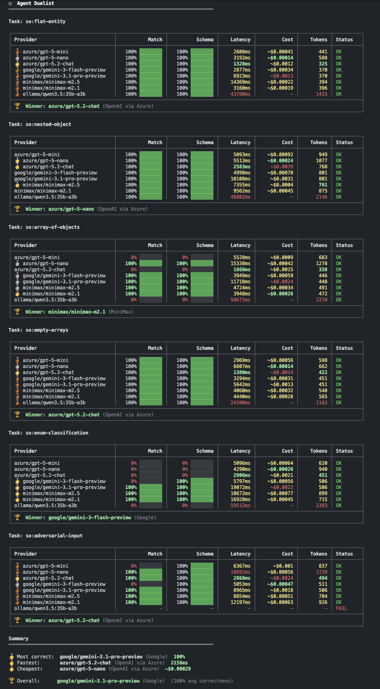

# agent-duelist

[](https://github.com/DataGobes/agent-duelist/actions/workflows/ci.yml)
[](https://datagobes.github.io/agent-duelist/)

> Pit LLM providers against each other on agent tasks — Duel your models.
>
> **[View the landing page →](https://datagobes.github.io/agent-duelist/)**

`agent-duelist` is a TypeScript-first framework to pit multiple LLM providers against each other on the same tasks and get structured, reproducible results: correctness, latency, tokens, and cost.

## What you get
> 


- Compare OpenAI, Azure OpenAI, Anthropic, Google Gemini, and any OpenAI-compatible gateway.
- Define tasks once, run them against many providers.
- Get CLI tables and JSON results you can feed into dashboards, CI, or docs.

---

## Why agent-duelist?

- **Provider-agnostic**: One config, many providers. Swap models and gateways without rewriting your tasks.
- **Agent-focused**: Designed for agent workflows and tool use, not just single-turn prompts.
- **Realistic metrics**: Latency, token counts, and cost estimates based on a pricing catalog.
- **TypeScript-native DX**: Strongly typed APIs, Zod schemas for structured outputs, and a simple `defineArena()` entrypoint.
- **CLI-first**: `npx duelist init` → `npx duelist run` gets you from zero to useful table in minutes.

---

## Installation

```bash
npm install agent-duelist
# or
pnpm add agent-duelist
# or
yarn add agent-duelist
```

You'll also need API keys for the providers you want to benchmark, for example:

```bash
export OPENAI_API_KEY=sk-...
export AZURE_OPENAI_API_KEY=...
export ANTHROPIC_API_KEY=...
export GOOGLE_API_KEY=...
```

---

## One-minute quickstart

Initialize a config:

```bash
npx duelist init
```

This creates `arena.config.ts` in your project. A minimal example:

```ts
// arena.config.ts
import { defineArena, openai, azureOpenai } from 'agent-duelist'
import { z } from 'zod'

export default defineArena({
  providers: [
    openai('gpt-5-mini'),
    azureOpenai('gpt-5-mini', { deployment: 'my-azure-deployment' }),
  ],
  tasks: [
    {
      name: 'simple-qa',
      prompt: 'In one sentence, explain what a monorepo is.',
      expected:
        'A monorepo is a single repository that contains code for multiple projects.',
    },
    {
      name: 'structured-extraction',
      prompt: 'Extract the company name and year from: "Acme was founded in 2024."',
      expected: { company: 'Acme', year: 2024 },
      schema: z.object({
        company: z.string(),
        year: z.number(),
      }),
    },
  ],
  scorers: ['latency', 'cost', 'correctness', 'schema-correctness', 'fuzzy-similarity'],
  runs: 3,
})
```

Run the benchmark:

```bash
npx duelist run
```

You'll see a matrix like:

- Rows: tasks (`simple-qa`, `structured-extraction`)
- Columns: providers (`openai/gpt-5-mini`, `azure/gpt-5-mini`)
- Cells: correctness score, latency, tokens, and estimated cost.

For CI or further processing:

```bash
npx duelist run --reporter json > results.json
```

---

## Core concepts

### Providers

Providers are **factory functions** that return plain objects implementing a shared `ArenaProvider` interface.

This lets you:

- Swap providers without changing tasks.
- Wrap or extend providers in your own code.
- Mock providers in tests.

Examples:

```ts
import {
  openai,
  azureOpenai,
  anthropic,
  gemini,
  openaiCompatible,
  type ArenaProvider,
} from 'agent-duelist'

const oai = openai('gpt-5-mini')

const azure = azureOpenai('gpt-5-mini', {
  deployment: 'my-deployment',
})

const claude = anthropic('claude-sonnet-4.6')

const gem = gemini('gemini-3-flash-preview') // uses GOOGLE_API_KEY

const local: ArenaProvider = openaiCompatible({
  id: 'local/llama',
  name: 'Local Gateway',
  baseURL: 'http://localhost:11434/v1',
  model: 'llama3.3',
  apiKeyEnv: 'LOCAL_LLM_API_KEY',
})
```

At minimum, a provider implements:

```ts
interface ArenaProvider {
  id: string        // e.g. 'openai/gpt-5-mini'
  name: string      // e.g. 'OpenAI'
  model: string
  run(input: TaskInput): Promise<TaskResult>
}
```

---

### Tasks

Tasks describe what you want the model to do:

```ts
interface ArenaTask {
  name: string
  prompt: string
  expected?: unknown         // used by correctness scorers
  schema?: ZodSchema<any>    // used by schema-based scorers
}
```

Examples:

```ts
const tasks: ArenaTask[] = [
  {
    name: 'classify-sentiment',
    prompt: 'Classify the sentiment of: "I love this product".',
    expected: 'positive',
  },
  {
    name: 'extract-structured-data',
    prompt: 'Extract { company, year } from: "Acme was founded in 2024."',
    expected: { company: 'Acme', year: 2024 },
    schema: z.object({
      company: z.string(),
      year: z.number(),
    }),
  },
]
```

---

### Scorers

Scorers take raw model outputs and turn them into **numeric scores** (0–1) with optional details. Built-in scorers:

| Scorer | What it measures |
|--------|-----------------|
| `latency` | Wall-clock response time in milliseconds |
| `cost` | Estimated USD cost from token usage and a bundled pricing catalog |
| `correctness` | Exact match against `expected` (deep-equal, key-order independent for objects) |
| `schema-correctness` | Validates output against the task's Zod `schema` via `safeParse()` |
| `fuzzy-similarity` | Jaccard token-overlap similarity between output and `expected` |
| `llm-judge-correctness` | Async LLM-as-judge — calls a judge model to score correctness 0–1 |

Configure them in your arena:

```ts
scorers: ['latency', 'cost', 'correctness', 'schema-correctness', 'fuzzy-similarity']
```

The `llm-judge-correctness` scorer evaluates outputs on three criteria (accuracy, completeness, conciseness) and returns a composite decimal score. Configure the judge model directly in your arena config:

```ts
defineArena({
  // ...
  scorers: ['latency', 'cost', 'correctness', 'llm-judge-correctness'],
  judgeModel: 'gemini-3.1-pro-preview', // or any OpenAI/Azure/Gemini model
})
```

The judge model defaults to `gpt-5-mini`. It can also be set via the `DUELIST_JUDGE_MODEL` env var. The judge backend is auto-detected from the model name — `gemini-*` models use Google's API, otherwise it falls back to OpenAI or Azure OpenAI.

You can also add custom scorers for domain-specific metrics (e.g. tool-call correctness, safety, style).

---

### Arena options

`defineArena()` accepts these top-level options alongside `providers`, `tasks`, and `scorers`:

| Option | Type | Default | Description |
|--------|------|---------|-------------|
| `runs` | `number` | `1` | Number of runs per provider × task combination. Higher values improve statistical confidence for CI regression detection. |
| `judgeModel` | `string` | `'gpt-5-mini'` | Model used by the `llm-judge-correctness` scorer. Also settable via `DUELIST_JUDGE_MODEL` env var. Gemini models auto-route to Google's API. |
| `timeout` | `number` | `60000` | Per-request timeout in milliseconds. Requests exceeding this are marked as failures. Prevents hanging on unresponsive APIs. |
| `sparklines` | `boolean` | `true` | Show sparkline bars next to percentage scores in the console reporter. Disable with `false` if your terminal doesn't render Unicode block characters well. |

Example with all options:

```ts
export default defineArena({
  providers: [openai('gpt-5-mini'), gemini('gemini-3-flash-preview')],
  tasks: [/* ... */],
  scorers: ['latency', 'cost', 'correctness', 'llm-judge-correctness'],
  runs: 3,
  judgeModel: 'gemini-3.1-pro-preview',
  timeout: 30_000,   // 30s — fail fast on slow APIs
  sparklines: false,  // plain percentages, no Unicode bars
})
```

---

## Cost & pricing

Cost estimation is intentionally transparent and conservative:

1. **Token counts**  
   Providers return token usage (prompt and completion tokens) in each `TaskResult`. These are treated as the source of truth.

2. **Pricing catalog**  
   `agent-duelist` ships with a **locally bundled catalog** of per-token prices for many models, derived from OpenRouter's public pricing pages.

   - The catalog maps `(provider, model)` → `{ inputPerM, outputPerM }` in USD per 1M tokens.
   - Azure OpenAI models are resolved back to their base OpenAI models where possible (e.g. `azure/gpt-5-mini` → `openai/gpt-5-mini`) so you don't need to configure Azure pricing manually.

3. **Estimated USD**  
   The `cost` scorer computes:

   ```text
   estimatedUsd = (promptTokens * inputPerM + completionTokens * outputPerM) / 1_000_000
   ```

   In the console reporter, you'll see:

   - token counts: `prompt: X, completion: Y`
   - cost: `~$0.0XXm` (millicents; fractions of a cent)
   - a short disclaimer that this is an **estimate** based on a pricing snapshot.

4. **Unknown models**  
   If a model is not in the catalog:

   - Tokens are still reported.
   - Cost is marked as unknown (no fake numbers).

You can update the catalog with a script that re-scrapes OpenRouter's public pricing page when prices change.

---

## CLI usage

### `duelist init`

Scaffold a new `arena.config.ts` in the current directory.

```bash
npx duelist init
```

### `duelist run`

Run benchmarks defined in your arena config.

```bash
# Run with the default config (arena.config.ts)
npx duelist run

# Use a custom config
npx duelist run --config path/to/arena.config.ts

# Get JSON instead of a table
npx duelist run --reporter json

# Suppress per-result progress lines
npx duelist run --quiet
```

| Option | Description |
|--------|-------------|
| `-c, --config <path>` | Path to config file (default: `arena.config.ts`) |
| `--reporter <type>` | Output format: `console` (default) or `json` |
| `-q, --quiet` | Suppress per-result progress |

### `duelist ci`

Run benchmarks, compare against a baseline, and enforce quality gates. Exits non-zero if regressions are detected or cost exceeds the budget.

```bash
# First run — establishes the baseline
npx duelist ci --update-baseline

# Subsequent runs — compare against baseline
npx duelist ci --threshold correctness=0.1 --budget 1.00

# Post comparison table as a PR comment (GitHub Actions)
npx duelist ci --threshold correctness=0.1 --comment
```

| Option | Description |
|--------|-------------|
| `-c, --config <path>` | Path to config file (default: `arena.config.ts`) |
| `--baseline <path>` | Baseline JSON file (default: `.duelist/baseline.json`) |
| `--budget <dollars>` | Max total cost in USD — fails if exceeded |
| `--threshold <scorer=delta>` | Regression threshold (repeatable, e.g. `--threshold correctness=0.1 --threshold cost=0.002`) |
| `--update-baseline` | Save results as new baseline after passing |
| `--comment` | Post markdown comparison table as a GitHub PR comment |
| `-q, --quiet` | Suppress per-result progress |

**How regression detection works:**

- With `runs > 1`, the CI uses 95% confidence intervals (t-distribution) — a scorer only regresses if the confidence intervals don't overlap beyond the threshold. This avoids false positives from noisy LLM outputs.
- With `runs === 1`, it uses a simple delta comparison.
- Without `--threshold` flags, regression detection is skipped entirely — only `--budget` is enforced.
- Results with high variance (CV > 0.3) are flagged as **flaky** with a warning.

The CLI loads TypeScript configs directly using a lightweight runtime loader so users don't need to precompile their config.

---

## Example: multi-provider benchmark

Here's a richer example comparing multiple providers across tasks:

```ts
// arena.config.ts
import { defineArena, azureOpenai } from 'agent-duelist'
import { z } from 'zod'

export default defineArena({
  providers: [
    azureOpenai('gpt-5-mini'),
    azureOpenai('gpt-5-nano'),
    azureOpenai('gpt-5.2-chat'),
  ],
  tasks: [
    {
      name: 'extract-company',
      prompt:
        'Extract the company name and role as JSON from: "I work at Acme Corp as a senior engineer." Return {"company": "...", "role": "..."}',
      expected: { company: 'Acme Corp', role: 'senior engineer' },
      schema: z.object({ company: z.string(), role: z.string() }),
    },
    {
      name: 'summarize',
      prompt:
        'Summarize in one sentence: TypeScript is a strongly typed programming language that builds on JavaScript, giving you better tooling at any scale.',
      expected:
        'TypeScript is a typed superset of JavaScript that improves tooling for projects of any size.',
    },
    {
      name: 'classify-sentiment',
      prompt:
        'Classify the sentiment of this review as "positive", "negative", or "neutral". Return only the classification word.\n\nReview: "The product arrived on time and works exactly as described. Very happy with my purchase!"',
      expected: 'positive',
    },
  ],
  scorers: ['latency', 'cost', 'correctness', 'schema-correctness', 'fuzzy-similarity'],
  runs: 3,
})
```

```bash
npx duelist run
```

Output includes box-drawing tables with medals, color-ranked metrics, sparkline bars, and a winner row per task — see the [screenshot above](#what-you-get) for a real example.

---

## Tool-calling agent example

agent-duelist supports tool-calling tasks — define tools with handlers, and the provider will execute them during the benchmark:

```ts
import { defineArena, openai } from 'agent-duelist'
import { z } from 'zod'

const weatherTool = {
  name: 'getCurrentWeather',
  description: 'Get the current weather in a given city',
  parameters: z.object({ city: z.string() }),
  handler: async ({ city }: { city: string }) => ({
    city,
    tempC: 20,
  }),
}

export default defineArena({
  providers: [openai('gpt-5-mini')],
  tasks: [
    {
      name: 'weather-tool-call',
      prompt: 'What is the current temperature in Amsterdam? Use the tool.',
      expected: { city: 'Amsterdam' },
      tools: [weatherTool],
    },
  ],
  scorers: ['latency', 'cost', 'tool-usage'],
  runs: 1,
})
```

The model calls `getCurrentWeather`, the handler returns a stub result, and the `tool-usage` scorer reports whether the expected tool was invoked. Tool calls and their results are included in the JSON output for inspection.

---

## CI / GitHub Actions

`duelist ci` is designed to run as a quality gate in your CI pipeline. It compares benchmark results against a saved baseline and fails the build if quality regresses or costs exceed a budget.

### GitHub Action

The easiest way to add eval quality gates to your PR workflow:

```yaml
# .github/workflows/eval.yml
name: LLM Eval
on: [pull_request]

jobs:
  eval:
    runs-on: ubuntu-latest
    steps:
      - uses: actions/checkout@v4
      - uses: DataGobes/agent-duelist/.github/actions/duelist-ci@main
        with:
          budget: '1.00'
          thresholds: 'correctness=0.1'
        env:
          OPENAI_API_KEY: ${{ secrets.OPENAI_API_KEY }}
```

The action handles Node.js setup, runs `duelist ci`, posts a comparison table as a PR comment, and optionally commits an updated baseline.

| Input | Default | Description |
|-------|---------|-------------|
| `config` | `arena.config.ts` | Path to arena config file |
| `baseline` | `.duelist/baseline.json` | Path to baseline JSON file |
| `budget` | — | Max total cost in USD |
| `thresholds` | — | Space-separated `scorer=delta` pairs |
| `update-baseline` | `false` | Save results as new baseline after passing |
| `comment` | `true` | Post results as PR comment |
| `node-version` | `20` | Node.js version to use |

### PR comment output

When `--comment` is enabled, the CI posts (or updates) a markdown table on the PR:

| Provider | Task | Scorer | Baseline | Current | Delta | Status |
|----------|------|--------|----------|---------|-------|--------|
| openai/gpt-5-mini | extract | correctness | 0.900 | 0.850 | -0.050 | ⚪ unchanged |
| openai/gpt-5-mini | extract | latency | 0.920 ± 0.030 | 0.890 ± 0.025 | -0.030 | ⚪ unchanged |

With cost summary, flakiness warnings, and pass/fail verdict.

---

## Roadmap

Shipped so far:

- OpenAI, Azure OpenAI, Anthropic, Google Gemini, and OpenAI-compatible providers
- 7 built-in scorers including LLM-as-judge, tool-usage, schema validation, and fuzzy similarity
- Tool-calling support with local handlers for agent task benchmarking
- Console reporter with box-drawing tables, medal rankings, sparkline bars (toggleable), and per-task winner rows
- Configurable per-request timeout to prevent hanging on unresponsive APIs
- JSON reporter for CI/pipeline integration
- Markdown reporter for PR comments
- `duelist ci` command with regression detection, cost budgets, and flakiness warnings
- GitHub Action for CI/CD integration
- Pricing catalog from OpenRouter with refresh script

Planned directions (subject to community feedback):

- **More providers**
  - OpenRouter-native and more OpenAI-compatible gateways.
- **Better reporting**
  - HTML and CSV export options.
- **Agent workflows**
  - Multi-step tool chains, multi-hop reasoning, and agent traces.
- **Plugin system**
  - First-class support for user-defined providers and scorers.
- **Embedding-based scoring**
  - Semantic similarity via embedding distance.

If you have a specific use case (framework comparisons, multi-agent competitions, tool-calling benchmarks), please open an issue — those will shape what gets built first.

---

## Contributing

Contributions, issues, and feature requests are welcome.

- **Bug reports / ideas**: open a GitHub issue.
- **Code changes**:
  - Fork the repo.
  - Create a branch.
  - Run tests: `npm test`.
  - Run build: `npm run build`.
  - Open a PR with a clear description and, if possible, a small repro.

Please try to keep PRs narrowly focused (single provider, one new scorer, etc.) so they're easy to review.

---

## License

MIT.
